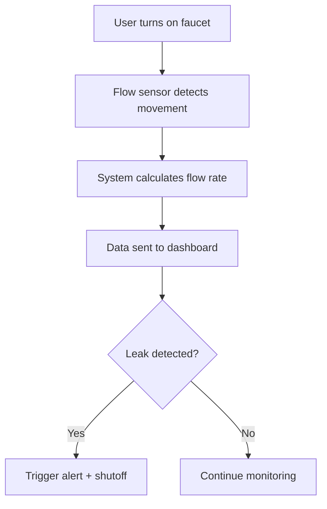

You are an expert in IoT systems analysis and system flow modeling.

Task: Analyze the following project and explain how the device is used from a user perspective. Focus on the **actual flow of interaction** between the user and the system. Do NOT provide implementation steps or code.

Project Title:
FlowGuard+: An IoT-Based Smart Water Monitoring System for Leak Detection, Automatic Faucet Shutoff, and Conservation Advisory

Instructions:

1. Understanding the System Flow

* Describe how the system works in real-world usage.
* Start from the moment the user interacts with the faucet/system.
* Include normal usage and abnormal scenarios (e.g., leak detected).
* Keep the explanation structured and sequential.

2. Input → Process → Output Mapping

* Break down the system into step-by-step actions.
* For each step, explicitly state:
  • Input (what triggers the action)
  • Process (what the system does internally)
  • Output (what the user/system receives)

Format example:
Input: User turns on faucet
Process: Flow sensor detects water movement
Output: System begins measuring water flow

3. User Interaction Perspective

* Explain what the user sees, hears, or experiences:
  • Alerts
  • Notifications
  • Automatic shutoff behavior
  • Dashboard updates

4. Edge Case Handling

* Include scenarios such as:
  • Continuous water flow (possible leak)
  • No usage for long periods
  • Sudden high consumption

5. Mermaid Flowchart (REQUIRED)

* At the end, generate a **Mermaid flowchart** that represents the full system flow.
* The flowchart must follow the exact sequence of usage.
* Use simple, readable nodes.

Format:

Rules:

* Ensure the flowchart matches the written explanation.
* Keep nodes concise and logical.
* Include both normal and abnormal paths (decision nodes).

Output:

* Section 1: Explanation of system flow
* Section 2: Input → Process → Output steps
* Section 3: User interaction summary
* Section 4: Mermaid diagram
